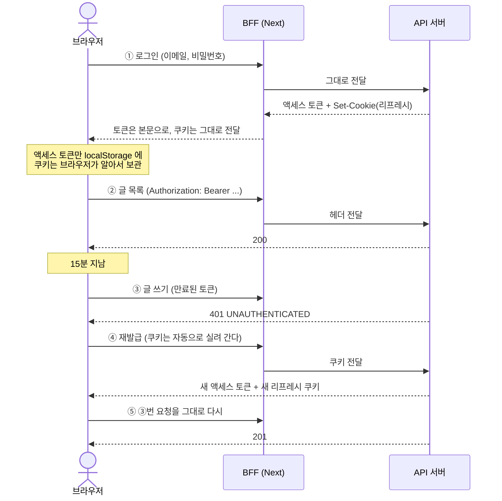

export const meta = {
  title: "액세스 토큰과 리프레시 토큰은 어떻게 이어지나",
  summary: "짧은 토큰과 긴 토큰을 나누는 이유, 만료된 토큰이 되살아나지 않는다는 것, 그리고 리프레시 토큰을 프론트엔드가 아예 만지지 못하게 두는 구성을 정리했다.",
  date: "2026-09",
  role: "인증",
  tags: ["jwt", "authentication", "token", "cookie", "login"],
};


로그인 흐름을 한 줄로 말하면 대개 이렇게 된다.

> 로그인하면 액세스 토큰을 받고, 프론트엔드가 헤더에 실어 보내면 로그인 상태가 되고, 액세스 토큰이 만료되면 리프레시 토큰이 액세스 토큰을 다시 살린다.

큰 줄기는 맞다. 다만 **"다시 살린다"** 와 **"프론트엔드가 보낸다"** 두 군데가 실제와 다르고, 그 차이가 구현을 가른다.

## 1. 먼저 그림으로

놀이공원에 갔다고 생각하면 구조가 거의 그대로 맞는다.

**입구에서 이름을 말하면 손목띠를 채워 준다.** 이게 액세스 토큰이다. 놀이기구를 탈 때마다 손목띠만 보여 주면 된다. 매번 "저 표 샀어요" 를 설명하지 않아도 된다.

**그런데 손목띠는 15분이면 색이 바랜다.** 왜 이렇게 빨리 바랠까. 누가 주워 가도 15분 뒤엔 쓸모없으라고 그렇게 만든 것이다.

**그럼 15분마다 집에 가야 하나.** 아니다. 입구 직원이 회원카드를 대신 보관하고 있다. 이게 리프레시 토큰이다. 바랜 띠를 들고 입구로 가면 회원카드를 확인하고 **새 손목띠**를 채워 준다.

여기가 첫 번째 대목이다. **바랜 띠를 다시 칠해 주는 것이 아니다.** 헌 띠는 버리고 새 띠를 받는다. 만료된 액세스 토큰은 영영 되살아나지 않는다.

**회원카드는 내 주머니에 없다.** 직원이 금고에 넣어 뒀다. 나는 꺼낼 수도 볼 수도 없다. 못 꺼내니까 잃어버릴 수도 없다.

여기가 두 번째 대목이다. **프론트엔드는 리프레시 토큰을 만지지 않는다.** 헤더에 실어 보내는 것은 액세스 토큰뿐이다.

## 2. 왜 둘로 나누나

토큰 하나로 끝내면 간단한데 굳이 둘인 이유는 **서명된 토큰을 도중에 취소할 방법이 없기 때문**이다.

서버는 토큰을 받을 때마다 서명이 맞는지와 만료 시각이 지났는지만 본다. 서명이 맞고 시각도 안 지났으면 서버 입장에서 그 토큰은 정상이다. 이미 나간 토큰을 되돌릴 장부가 없다(→ [JWT의 구조와 서명 검증 원리](/cases/jwt-signature)).

취소를 못 하니 **살아 있는 시간을 줄이는** 쪽으로 간다.

| | 액세스 토큰 | 리프레시 토큰 |
| --- | --- | --- |
| 수명 | 15분 | 14일 |
| 쓰는 곳 | 모든 API 요청 | 재발급 요청 하나 |
| 어디에 두나 | `localStorage` | `httpOnly` 쿠키 |
| 자바스크립트가 읽나 | 읽는다 | **못 읽는다** |
| 새는 경로 | XSS | (자바스크립트로는 못 읽음) |

표 1. 두 토큰의 수명과 보관 위치

**자주 쓰는 것은 짧게, 오래 사는 것은 손이 닿지 않는 곳에.** 이 한 줄이 분리의 전부다.

액세스 토큰을 `localStorage` 에 두는 것은 안전한 선택이 아니다. 페이지에 끼어든 스크립트가 읽어 간다. 대신 15분이라 새어 나가도 그 시간이 지나면 쓸모가 없다. **안전해서가 아니라 짧아서 감당하는 것이다.**

## 3. 요청 하나가 지나가는 길



③에서 ⑤까지가 **화면 코드 한 줄도 없이** 일어난다. GraphQL 클라이언트 안에 들어 있다.

```ts
if (err.code === "UNAUTHENTICATED" && (await refresh())) {
  return await send(document, variables);   // 원래 요청을 그대로 다시
}
throw err;
```

**딱 한 번만 시도한다.** 재발급이 또 `401` 을 주는 상황에서 다시 시도하면 무한히 돈다.

그리고 **재발급이 실패하면 그때 던진다.** 만료됐다고 곧바로 로그인 화면으로 보내면 사용자는 15분마다 쫓겨난다.

## 4. 쿠키에 붙인 속성들

리프레시 토큰을 심는 쪽 코드는 짧은데, 속성 하나하나가 막는 것이 다르다.

```ts
{
  httpOnly: true,
  sameSite: "strict",
  secure: NODE_ENV === "production",
  path: "/auth",
  maxAge: 14일,
}
```

| 속성 | 막는 것 |
| --- | --- |
| `httpOnly` | 자바스크립트가 읽는 것 — XSS 로 훔쳐 가는 경로 |
| `sameSite: strict` | 다른 사이트에서 보낸 요청에 쿠키가 실리는 것 — CSRF |
| `secure` | 암호화되지 않은 연결로 나가는 것 |
| `path: "/auth"` | 재발급과 무관한 요청에 실려 다니는 것 |

표 2. 쿠키 속성이 각각 막는 것

`httpOnly` 가 XSS 를 막는 대신 **쿠키는 요청에 자동으로 실려 간다.** 그래서 CSRF 를 따로 막아야 하고 `sameSite` 가 그 몫이다. 어느 쪽도 공짜가 아니다(→ [쿠키 인증에 CSRF 토큰이 필요한 이유](/cases/csrf-token-frontend)).

`path` 를 좁힌 것도 같은 결의 선택이다. 글 목록을 부를 때마다 리프레시 토큰이 같이 날아갈 이유가 없다. **필요한 요청에만 실린다.**

## 5. 토큰이 자기가 무엇인지 말한다

페이로드에 `typ` 을 넣었다.

```json
{ "typ": "access", "sub": "…", "iat": …, "exp": … }
```

**리프레시 토큰으로 API 를 부르는 것을 막기 위해서다.** 둘 다 같은 키로 서명하니 서명만 보면 구분이 안 된다. 검증할 때 "지금 기대하는 종류" 를 같이 넘기고 다르면 거부한다.

페이로드에 들어가는 것은 `sub`(사용자 id)·`exp`·`iat`·`typ` 넷뿐이다. **이메일도 닉네임도 넣지 않았다.** 토큰은 서명된 것이지 암호화된 것이 아니라서, 가운데 조각을 떼어 디코딩하면 누구나 읽는다.

## 6. 쓸 때마다 새것으로 바꾼다

재발급 요청은 새 액세스 토큰만 주는 것이 아니라 **리프레시 쿠키도 새것으로 갈아 끼운다.** 회전(rotation)이라고 한다.

옛 리프레시 토큰이 새어 나갔더라도 유효 기간이 그만큼 짧아진다. 14일이 아니라 "다음 재발급까지" 가 된다.

재발급할 때 서명만 믿지 않고 **계정이 아직 있는지 한 번 확인한다.** 토큰은 멀쩡한데 계정이 지워졌을 수 있다.

## 7. 로그아웃 — 쿠키는 서버만 지울 수 있다

처음에는 로그아웃이 `localStorage` 의 액세스 토큰만 지웠다. **리프레시 쿠키는 그대로 남았다.** 같은 브라우저에서 재발급을 부르면 새 토큰이 나왔다. 화면상으로는 로그아웃인데 서버가 보기엔 아직 로그인한 사람이었다.

쿠키는 `httpOnly` 라 자바스크립트가 읽지도 지우지도 못한다. **그래서 로그아웃이 요청이 된다.**

```
POST /auth/logout → 204
Set-Cookie: refresh_token=; Expires=Thu, 01 Jan 1970 …
```

정한 것이 셋이다.

- **로그인을 요구하지 않는다.** 액세스 토큰이 만료된 사람도 로그아웃할 수 있어야 한다. 만료를 이유로 `401` 을 주면 쿠키가 살아남고 그 사람은 영영 로그아웃하지 못한다. 로그아웃은 권한이 필요한 일이 아니라 **가진 것을 버리는 일**이라 가진 게 없어도 된다.
- **쿠키가 없어도 `204` 다.** 이미 로그아웃된 사람이 한 번 더 눌러도 결과는 같다. 결과가 같으면 같은 답을 준다.
- **본문이 없다.** 이 요청의 결과는 응답 본문이 아니라 `Set-Cookie` 헤더다.

### 지우는 옵션을 따로 만든 이유

브라우저는 이름만으로 쿠키를 가리지 않는다. **`path`·`sameSite`·`secure` 까지 같아야 같은 쿠키다.** 하나라도 다르면 지워지지 않는데 응답은 `204` 로 성공이다. **성공처럼 보이는 실패**가 된다.

그래서 심는 값과 지우는 값을 한 곳에서 만든다. 지울 때만 `maxAge` 를 뺀다 — 만료 시각을 과거로 넣는 것이 "지운다" 의 실제 구현이라 남은 수명을 같이 보내면 서로 싸운다.

## 8. 화면이 로그아웃을 모르던 문제

로그아웃을 눌러도 헤더에 닉네임이 그대로 남고 새로고침해야 바뀌는 증상이 있었다. 원인이 두 군데 맞물려 있었다.

**하나 — 저장소가 조용했다.** `localStorage` 는 **같은 탭에서 바뀔 때 `storage` 이벤트를 쏘지 않는다.** 쓴 탭은 이미 알 것이라고 보기 때문이다. 그래서 다른 탭의 로그아웃만 들렸다.

**둘 — 캐시를 비우는 것으로는 화면이 안 움직였다.** 쿼리 캐시에서 항목을 **제거**하는 것은 구독자에게 새 결과를 밀어 주지 않는다. 훅은 지워지기 직전의 값을 그대로 쥐고 있다.

로그인이 멀쩡했던 것은 로그인 쪽이 캐시에 **값을 밀어 넣는** 동작이라서다. **지우는 것과 넣는 것은 대칭이 아니다.**

고친 방법은 저장소가 스스로 알리게 하는 것이었다.

```ts
set(token) { localStorage.setItem(KEY, token); notify(); }
clear()    { localStorage.removeItem(KEY);     notify(); }
```

그리고 헤더가 캐시가 아니라 **토큰을 보게** 바꿨다. 상태를 들고 있는 것이 저장소라면, 그 상태가 바뀐 것을 알릴 수단도 저장소가 같이 들고 있어야 한다.

## 이 구성이 막는 것과 못 막는 것

**막는 것**은 액세스 토큰이 새어도 15분이라는 점, 리프레시 토큰이 자바스크립트에 안 보인다는 점, 다른 사이트에서 보낸 요청에는 쿠키가 안 실린다는 점이다.

**못 막는 것**이 하나 남아 있다. 로그아웃이 지우는 것은 **그 브라우저의 쿠키**다. 리프레시 토큰이 이미 새어 나갔다면 그 토큰은 만료까지 살아 있다. 서명이 유효하고 사용자가 존재하면 재발급이 통과시킨다.

막으려면 서버가 상태를 들어야 한다. 사용자마다 "이 시각 이전에 발급된 토큰은 무효" 라는 시각을 하나 두고, 로그아웃할 때 지금 시각으로 올린 뒤 재발급에서 토큰의 발급 시각과 비교하면 된다. 컬럼 하나와 비교 한 줄이다.

그 한 줄을 아직 넣지 않았다. 상태 없이 검증하는 성질을 깨는 결정이라 그럴 이유가 생겼을 때 하는 편이 낫다고 봤다. 다만 **"로그아웃했으니 안전하다" 고 말하지는 않는다** — 안전한 것은 "이 브라우저에서 내려왔다" 까지다.

## 관련 글

- [JWT의 구조와 서명 검증 원리](/cases/jwt-signature)
- [쿠키와 세션으로 로그인 상태를 유지하는 원리](/cases/session-cookie-login)
- [쿠키 인증에 CSRF 토큰이 필요한 이유](/cases/csrf-token-frontend)
- [게시판 API 서버를 아홉 단계로 만들면서 정한 것들](/cases/board-api-nine-steps)
