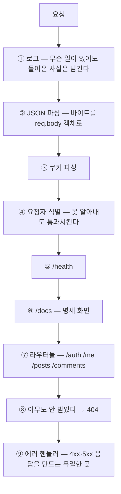
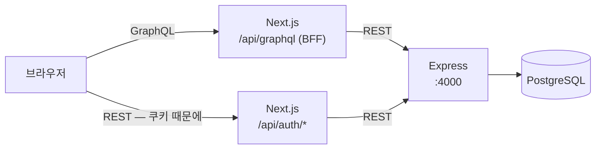
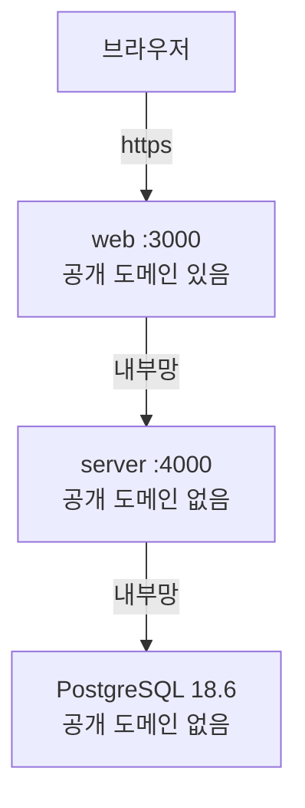

export const meta = {
  title: "게시판 API 서버를 아홉 단계로 만들면서 정한 것들",
  summary: "도메인 정의부터 배포까지 순서대로 밟으면서 스택을 하나씩 들였다. 각 도구가 어느 문제를 맡았는지, 그 선택이 무엇을 포기한 것인지 정리했다.",
  date: "2026-09",
  role: "백엔드",
  tags: ["express", "postgresql", "prisma", "graphql", "architecture", "deployment"],
};


게시판 하나를 만드는 데 아홉 단계가 필요하지는 않다. `POST /posts` 로 글을 넣고 `GET /posts` 로 꺼내면 그게 게시판이다. 한나절이면 된다.

아홉으로 나눈 이유는 **한 번에 다 넣으면 왜 넣었는지 모르기 때문**이다. 처음부터 인덱스가 붙어 있으면 인덱스가 무엇을 해결하는지 알 수 없다. 느린 것을 먼저 보고 붙여야 그게 무엇인지 안다.

그래서 매 단계 **문제가 먼저 나오고 도구가 나중에 들어왔다.** 이 글은 어느 자리에서 무엇이 들어왔고 그때 무엇을 포기했는지에 대한 기록이다.

## 1. 단계마다 무엇이 늘었나

| 단계 | 문제 | 들인 것 |
| --- | --- | --- |
| 1 도메인 | 무엇을 만들 것인가 | 문서만. 코드 없음 |
| 2 API 설계 | 이름과 상태 코드를 먼저 정한다 | OpenAPI 명세 |
| 3 메모리 CRUD | 저장소 없이 흐름부터 | Express 5, 배열 |
| 4 PostgreSQL | 서버를 끄면 다 사라진다 | Docker, Prisma, PostgreSQL |
| 5 검증과 에러 | 잘못된 입력이 500 을 낸다 | zod |
| 6 인증과 권한 | 남의 글을 고칠 수 있다 | argon2, jose(JWT), 쿠키 |
| 7 목록 고도화 | 글이 1만 건이면 느리다 | 인덱스, 커서 페이지네이션 |
| 8 프론트 연결 | 화면이 없다 | Next.js, GraphQL BFF, TanStack Query |
| 9 배포와 운영 | 내 노트북에서만 돈다 | Docker 이미지, 로그, 헬스체크, 플랫폼 |

표 1. 단계별로 나온 문제와 그때 들어온 도구

**3단계에 DB 가 없는 것**이 이 순서의 핵심이다. 글을 배열에 담아 두고 서버를 껐다 켜면 전부 사라진다. 그 경험을 하고 4단계로 가야 "영속성" 이라는 말이 무슨 뜻인지 몸으로 안다.

## 2. 스택이 각각 맡은 일

도구를 나열하면 목록이 되지만, **각자 어느 문제를 맡았는지**로 보면 이유가 보인다.

| 도구 | 맡은 문제 | 없으면 |
| --- | --- | --- |
| Express 5 | 요청을 순서대로 통과시킨다 | 직접 `http` 모듈로 라우팅을 짠다 |
| zod 4 | 들어온 값이 약속한 모양인지 확인한다 | 라우터마다 `if` 가 쌓이고 메시지가 제각각이 된다 |
| Prisma 7 | SQL 과 타입스크립트 타입을 잇는다 | 쿼리 결과가 `any` 다 |
| PostgreSQL 18 | 데이터를 남기고 관계를 강제한다 | 서버를 끄면 사라진다 |
| argon2 | 비밀번호를 되돌릴 수 없게 만든다 | DB 가 새면 비밀번호가 같이 샌다 |
| jose | 토큰에 서명하고 검증한다 | 남의 id 를 적어 보내면 그 사람이 된다 |
| pino | 무슨 일이 있었는지 남긴다 | 배포 후 장애의 원인을 못 찾는다 |
| Next.js 16 | 화면을 그리고 BFF 를 얹는다 | 화면과 API 가 각각 배포된다 |
| GraphQL Yoga | 화면이 필요한 모양으로 데이터를 묶는다 | 화면 하나에 요청을 네 번 보낸다 |
| TanStack Query | 서버 데이터의 캐시·재요청을 맡는다 | `useEffect` 와 `useState` 로 로딩·에러를 직접 짠다 |
| Docker | 어디서든 같은 환경으로 띄운다 | "내 노트북에서는 되는데" |

표 2. 스택과 각자가 맡은 문제

### 버전을 고정한 것

```
Express 5.1 · zod 4.6 · Prisma 7.10.0 · PostgreSQL 18.6
Next.js 16.3.5 · React 19.2.8 · GraphQL 17 · TanStack Query 5.103
```

Prisma 는 `^` 없이 **정확한 버전으로 못 박았다.** `prisma@latest` 를 받았더니 `8.0.0-rc` 가 왔다. CLI 와 클라이언트가 따로 올라가면 생성물과 런타임이 어긋난다.

PostgreSQL 은 로컬과 배포를 **마이너 자리까지 맞췄다.** 배포 쪽 관리형 DB 가 18 이라 로컬 16 을 18.6 으로 올렸다. "로컬에서는 되는데" 를 세 번 겪은 뒤의 결정이다.

## 3. 요청이 서버 안에서 지나가는 길

`app.ts` 의 줄 순서가 곧 요청이 지나가는 길이다. 줄을 위아래로 옮기면 동작이 바뀐다.



**①이 맨 위인 이유**는 뒤에서 무슨 일이 나도 요청이 들어온 사실은 남기기 위해서다. ② 아래로 내리면 파싱 단계에서 죽은 요청이 로그에 안 찍힌다.

**④는 식별만 하고 강제하지 않는다.** 로그인 없이 볼 수 있는 화면이 있어서다. `401` 은 라우터마다 끼우는 `requireAuth` 가 낸다. 둘을 합쳐 전역에 두면 글 목록이 로그인을 요구하게 된다.

**⑨는 인자가 네 개라서 에러 핸들러다.** Express 는 등록된 함수의 인자 개수를 세어 3개면 보통 미들웨어, 4개면 에러 핸들러로 분류한다. 안 쓰는 네 번째 인자를 지우면 그 순간 에러를 못 받는 평범한 미들웨어가 된다.

### 상태 코드를 값으로 정해 두기

5단계에서 제일 오래 붙잡은 것이 `400` 과 `422` 를 가르는 기준이었다. 규칙을 두 줄로 정했다.

- **쿼리·경로 파라미터는 무조건 `400`.** URL 에 적히는 값은 형식 이전에 자리부터 틀린 것이다.
- **본문은 zod 의 issue code 로 나눈다.** `invalid_type`·`invalid_format`·`unrecognized_keys` 는 `400`, `too_small`·`too_big`·`custom` 은 `422`.

둘이 섞이면 `400` 이 이긴다. **형식이 틀린 것과 값이 범위를 벗어난 것은 고쳐야 할 곳이 다르다.** 제목이 숫자로 왔으면 프론트의 타입이 틀린 것이고, 제목이 201자면 사용자가 너무 많이 쓴 것이다.

## 4. 목록이 느려지는 자리

7단계에서 글 1만 건과 댓글 5만 건을 넣고 재기 시작했다. **느린 것을 먼저 보는 단계**다.

### 오프셋은 뒤로 갈수록 느려진다

| 위치 | 걸린 시간 | 읽은 행 |
| --- | --- | --- |
| `OFFSET 0` | 0.053 ms | 20 |
| `OFFSET 1000` | 0.215 ms | 1,020 |
| `OFFSET 5000` | 0.725 ms | 5,020 |
| `OFFSET 9980` | 1.504 ms | 10,000 |

표 3. 오프셋 위치별 실행 시간과 읽은 행 수

읽은 행 수를 보면 이유가 그대로 보인다. **`OFFSET 9980` 은 앞의 9,980 행을 전부 읽고 버린다.** 버리려고 읽는 것이다.

커서 방식은 같은 위치에서 **0.055 ms, 19 행**이었다. "몇 번째부터" 가 아니라 "이 값 다음부터" 라고 물으면 앞을 읽을 이유가 없다.

대신 포기한 것이 있다. **페이지 번호로 점프할 수 없다.** 7페이지로 바로 가는 기능은 이 방식으로 못 만든다. 무한 스크롤에는 문제가 없지만 게시판 하단의 `1 2 3 4 5` 를 원한다면 오프셋을 써야 한다.

### 인덱스 전후

```sql
CREATE INDEX ON posts ("createdAt" DESC, id DESC);
```

| | 전 | 후 |
| --- | --- | --- |
| 실행 계획 | `Seq Scan` + `Sort` | `Index Only Scan` |
| 읽은 행 | 10,000 | 21 |
| 실행 시간 | 1.922 ms | **0.049 ms** |

표 4. 복합 인덱스 적용 전후 비교

약 **39배**다. `Index Only Scan` 은 테이블 본체를 아예 열지 않는다 — 필요한 컬럼이 인덱스 안에 다 들어 있어서다.

`id` 를 두 번째 정렬 키로 넣은 이유는 **`createdAt` 이 같은 글이 있을 수 있어서**다. 정렬 순서가 요청마다 달라지면 커서가 가리키는 위치도 흔들린다.

### 댓글 수를 세는 N+1

글 20건을 보여 주면서 각 글의 댓글 수를 세면 질의가 21번 나간다. 목록 1번 + 글마다 1번이다.

Prisma 의 `_count` 로 바꾸니 **글 1건이든 50건이든 질의가 2번**으로 고정됐다. `COUNT(*)` 를 따로 부르는 방식(1.259 ms)도 재 봤는데, 전체 개수를 화면이 안 쓰기 때문에 넣지 않았다.

## 5. 클라이언트 — 왜 GraphQL 을 서버에 안 넣었나

화면이 필요한 데이터는 글 목록 + 작성자 + 댓글 수처럼 **묶여 있다.** REST 로 받으면 요청이 여러 번 나가거나, 서버가 화면 사정을 알아야 한다.

그렇다고 Express 를 GraphQL 로 바꾸지는 않았다.



**서버는 REST 로 두고 GraphQL 은 Next 안에 BFF 로 넣었다.**

1. **명세를 보여줘야 한다.** REST 여야 OpenAPI 로 적어 Swagger UI 에 띄울 수 있다. 프론트엔드 개발자에게 주소 하나를 줄 수 있다.
2. **화면이 필요한 모양은 화면 쪽에서 정한다.** 화면이 바뀔 때 서버를 고치지 않아도 된다.

대신 **같은 데이터를 두 번 정의한다.** OpenAPI 에 한 번, GraphQL 스키마에 한 번. 이게 이 구조의 값이다.

### 인증만 REST 한 겹으로 남긴 이유

리프레시 토큰이 `httpOnly` 쿠키인데 **쿠키는 HTTP 의 것이고 GraphQL 은 그것을 모른다.** GraphQL 응답에 `Set-Cookie` 를 끼워 넣을 수는 있지만, 그러려면 리졸버가 응답 객체를 알아야 하고 "스키마가 곧 계약" 이라는 성질이 깨진다.

그래서 로그인·재발급·로그아웃만 `/api/auth/*` 로 빼고 나머지는 전부 GraphQL 이다. 토큰이 실제로 어떻게 이어지는지는 [액세스 토큰과 리프레시 토큰은 어떻게 이어지나](/cases/access-refresh-token-flow)에 따로 적었다.

### DDD 레이어와 ESLint

클라이언트를 네 층으로 나눴다.

```
domain          아무것도 import 하지 않는다
application     유스케이스와 포트(인터페이스)
infrastructure  포트의 구현 — GraphQL·localStorage
presentation    화면
composition     조립. infrastructure 를 아는 유일한 곳
```

**경계를 문서가 아니라 ESLint 로 강제했다.** `no-restricted-imports` 에 층마다 금지 대상을 적어 두면 `domain` 에서 `infrastructure` 를 부르는 순간 빌드가 멈춘다. 문서로만 적어 두면 바쁜 날 무너진다.

## 6. 배포 — 밖으로 나가는 것은 하나



**BFF 가 Express 를 대신 부르므로 서버를 인터넷에 열 이유가 없다.** 명세 화면(`/docs`)조차 Next 가 대신 받아 내부 주소로 넘긴다.

구성은 대시보드에서 클릭하지 않고 **코드 한 파일로 선언했다.** 클릭은 기록이 남지 않는다 — 왜 그 값인지, 언제 바뀌었는지 아무도 모른다.

숫자 하나가 맞물려 있다. 플랫폼이 종료 신호를 보낸 뒤 기다려 주는 시간(15초)이 서버의 강제 종료 타임아웃(10초)보다 길어야 한다. **두 값은 따로 정하면 안 된다.**

마이그레이션은 컨테이너 시작 명령이 아니라 **배포 훅**에 넣었다. 컨테이너가 여러 개 뜨면 시작 명령은 동시에 돌지만 배포 훅은 배포당 한 번이다.

## 7. 배포하고 나서 일부러 고장 냈다

환경변수 하나를 지웠다. **아무 일도 일어나지 않았다.**

```
공개 URL 200
{"data":{"posts":{"items":[{"title":"공개 URL 에서 쓴 첫 글"}]}}}
```

이미 도는 컨테이너는 옛 환경을 들고 있다. **장애는 다음 배포에서 터진다** — 며칠 뒤, 그 변경과 아무 상관없는 배포를 했을 때.

이게 더 고약한 종류다. 원인과 증상 사이에 시간이 끼어 있으면 아무도 둘을 잇지 못한다.

재배포하니 실패했다. 그런데 로그를 보니 **정상적인 요청 로그만 흐르고 있었다.** 배포 로그 명령이 기본적으로 **마지막 성공 배포**를 보기 때문이었다. 실패한 배포를 짚어서 보니 원인이 한 줄로 적혀 있었다.

```
환경변수가 올바르지 않습니다:
  JWT_SECRET — 반드시 있어야 합니다.
```

9단계 초반에 "무엇이 왜 틀렸는지 한 줄씩 찍게" 만들어 둔 값이 여기서 돌아왔다. `invalid env` 한 줄이었으면 어느 값인지 찾느라 배포 설정을 뒤졌을 것이다.

## 8. 검사를 코드 옆에 두기

매 단계 셸 스크립트로 검사했는데, 그게 임시 디렉터리에만 있었다. **끝나면 사라지는 검사는 회귀 검사가 아니다.**

| 검사 | 무엇을 | 개수 |
| --- | --- | --- |
| 검증·에러 | 상태 코드, 에러 형태, 내부 유출 | 16 |
| 인증·권한 | 완성 시나리오, 해시, 토큰, 쿠키 | 27 |
| 배포본 | 공개 URL 의 완성 시나리오 | 12 |
| 스모크 | 배포 직후 전 구간 (읽기만) | 5 |

표 5. 레포에 넣은 검사와 개수

레포로 옮긴 첫 실행에서 **16개 중 8개가 실패했다.** 서버는 멀쩡했다. 값을 꺼내는 헬퍼가 없는 값에 `undefined` 라는 다섯 글자 문자열을 찍었고, 받는 쪽이 그것을 "토큰을 받았다" 로 읽은 것이었다.

```js
console.log(v ?? "")   // 이 한 줄이 없었다
```

**비어 있음을 비어 있음으로 표현하지 않은 코드**가 어떻게 무너지는지 보여 주는 예다. 그리고 검사 스크립트의 버그는 코드의 버그처럼 보인다.

CI 를 붙였더니 첫 판에 또 하나를 잡았다.

```
Module '"@prisma/client"' has no exported member 'PrismaClient'.
```

Prisma 클라이언트는 `node_modules` 안에 **생성되는** 코드라 설치만으로는 존재하지 않는다. 로컬에는 오래전에 만들어 둔 게 있어서 안 보였다. **깨끗한 환경에서 처음부터 돌려 보지 않으면 계속 숨어 있는 종류**다.

## 순서가 만든 것

아홉 단계가 가르쳐 준 것은 도구 목록이 아니라 **도구가 없을 때 무엇이 불편한가**였다.

zod 없이 `if` 를 쌓아 보고, 인덱스 없이 1.922 ms 를 보고, 로그 없이 배포된 서버가 왜 죽었는지 찾아보는 일이 먼저 있었다. 그러고 나서 들인 도구는 이름이 아니라 **쓸모**로 기억된다.

그 대신 포기한 것들도 같이 남았다. 커서 페이지네이션은 페이지 번호를 포기했고, BFF 는 스키마를 두 번 쓰기로 했고, 무상태 토큰은 즉시 취소를 포기했다. 어느 쪽도 공짜가 아니다.

## 관련 글

- [액세스 토큰과 리프레시 토큰은 어떻게 이어지나](/cases/access-refresh-token-flow)
- [JWT의 구조와 서명 검증 원리](/cases/jwt-signature)
- [FSD에서 DDD로 레이어를 옮기며 정리한 기준](/cases/fsd-to-ddd)
