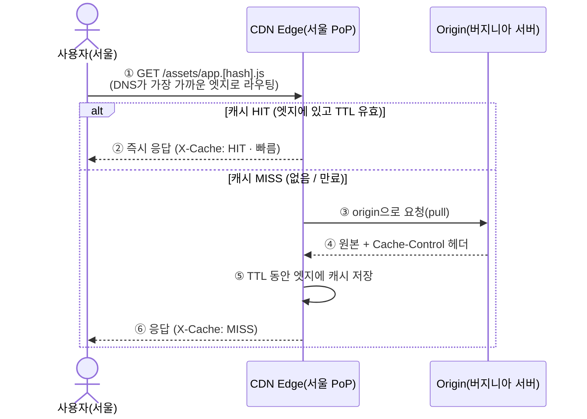

export const meta = {
  title: "CDN 은 어떻게 가까운 데서 파일을 내주나",
  summary:
    "이미지를 바꿔서 다시 올렸는데 브라우저에는 예전 이미지가 그대로 나온다. 파일은 분명히 새로 올라가 있다.",
  date: "2026-07",
  role: "전송·캐시",
  tags: ["cdn", "caching", "performance", "frontend"],
};


이미지 몇 장을 바꿔서 다시 올렸는데 브라우저에는 예전 이미지가 그대로 나온다. 파일은 분명히 새로 올라가 있다. 강력 새로고침을 하면 그제야 바뀐 게 보인다.

그러니까 요청이 원본 서버까지 안 갔다는 뜻이다. 중간 어딘가가 예전 파일을 들고 있다가 대신 내줬다. 그 중간은 대체 어디에 있고, 언제까지 예전 걸 들고 있는 것인가.

그 중간에 있는 게 CDN 이다. 이 글은 CDN 의 역할이 무엇인지, 언제 원본까지 다녀오고 언제 안 다녀오는지, 그리고 바뀐 파일을 언제 보여줄지를 누가 정하는지까지 본다.

## 1. 파일은 어디서 오고 있었나

브라우저 개발자 도구의 Network 탭을 열면 파일이 줄줄이 뜬다. HTML 하나, CSS 몇 개, JS 몇 개, 이미지 여러 장. 그 하나하나가 전부 어딘가의 서버에서 온 것이다.

서버가 하나 있고 세상 모든 사람이 거기 접속한다. 이렇게 그려 두기 쉽다. 그렇게 만든 사이트도 있다. 문제는 그 서버가 미국 버지니아에 있고 사용자는 서울에 있을 때다. 요청 하나가 태평양을 왕복한다. 파일이 하나면 견딜 만한데 수십 개면 그 왕복이 수십 번이다.

원본 파일이 실제로 놓여 있는 서버를 오리진(origin)이라고 한다. 말 그대로 원본이 있는 자리다. CDN 은 Content Delivery Network 의 약자인데, 하는 일은 이 오리진에서 파일을 미리 복사해다가 **세계 곳곳에 흩어 놓은 서버**에 채워 두는 것이다. 그러면 서울 사람은 서울 근처 서버에서 받는다. 태평양을 안 건넌다.

이 흩어 놓은 서버 하나하나를 엣지(edge)라고 하고, 엣지가 모여 있는 지점을 PoP(Point of Presence)라고 한다. 둘 다 이름만 보면 뜻이 잡히지 않는데, 그냥 **사용자 가까이에 있는 복사본 서버**라고 읽으면 대체로 맞는다.

굳이 하나만 빗대자면 편의점이다. 본사 창고 한 곳에서 전국에 택배를 보내면 느리다. 대신 동네 편의점에 잘 나가는 물건을 미리 채워 두면 손님은 동네에서 바로 산다. 편의점에 그 물건이 없을 때만 본사에서 가져온다. CDN 이 하는 일도 딱 이만큼이다.

## 2. 가까우면 뭐가 그렇게 좋을까

거리가 줄어서 빨라진다는 건 바로 읽힌다. 그런데 CDN 소개 문서를 읽으면 속도 말고 다른 얘기가 계속 나온다. 부하가 어떻고 비용이 어떻고 DDoS 가 어떻고. 빨라지는 것과 요금이 싸지는 것이 무슨 상관인가 싶은 자리다.

붙여 보면 전부 같은 사실에서 나온다. **요청이 오리진까지 안 간다**는 사실 하나다.

| 문제          | CDN 이 해결하는 방식                                                               |
| ------------- | ---------------------------------------------------------------------------------- |
| 지연(latency) | 물리적 거리가 줄어 가까운 엣지가 응답한다                                          |
| origin 부하   | 대부분의 요청을 엣지가 받아 내서 원본 서버로 가는 트래픽이 크게 준다               |
| 대역폭 비용   | origin 이 밖으로 내보내는 데이터가 줄어 이그레스 비용이 준다                       |
| 가용성·보안   | origin 이 죽어도 캐시로 얼마간 버티고, DDoS 완화·WAF·TLS 종단 처리를 엣지가 맡는다 |

표 1. CDN 이 푸는 네 가지 문제와 그 방식

요청이 엣지에서 끝나면 오리진까지 갈 일이 없다. 서버가 덜 바쁘고, 데이터를 덜 내보내니 요금이 덜 나오고, 공격 트래픽도 엣지가 먼저 받는다.

## 3. HIT 과 MISS, 이 두 글자가 전부다

응답 헤더의 `X-Cache: HIT` 은 성공 표시로 읽기 쉽다. 요청이 잘 갔다는 뜻이겠거니 하는 것이다. 아니다.

HIT 은 **엣지에 이미 있어서 오리진까지 안 갔다**는 뜻이고, MISS 는 **엣지에 없어서 오리진까지 갔다 왔다**는 뜻이다. 둘 다 사용자는 파일을 정상적으로 받는다. 다른 건 그 파일이 어디서 왔느냐뿐이다.



그림을 따라가면서 붙잡아 둘 게 넷 있다.

먼저 **엣지 라우팅**이다. 서울에 있는 사용자를 서울 엣지로 보내 주는 건 DNS 다. anycast 나 geo-DNS 같은 방식으로 가장 가까운 엣지 주소를 내려준다. 따로 설정하지 않아도 가까운 데로 가는 이유가 여기 있다.

다음은 **cache key** 다. 엣지는 요청을 URL 을 기준으로 구분한다. 헤더 일부가 같이 들어가기도 한다. 키가 같으면 같은 캐시를 나눠 쓰고, 키가 다르면 별개로 저장한다. 그래서 URL 이 바뀌면 그건 엣지 입장에서 완전히 새 파일이다. 이 성질을 5절에서 그대로 써먹는다.

세 번째는 **TTL** 이다. 엣지가 "이 복사본은 아직 쓸 만하다"고 보는 기간이다. 이 기간이 지나면 같은 URL 이라도 MISS 로 떨어진다. 얼마로 할지는 오리진이 내려주는 `Cache-Control` 헤더가 정한다.

마지막은 **origin pull** 이다. 그럼 엣지에 있는 복사본은 애초에 누가 거기 갖다 놓는 것인가. CDN 은 배포할 때 전 세계 엣지에 파일을 미리 밀어 넣는 방식이 아니다. MISS 가 났을 때 그때 가서 오리진에서 당겨오고, 당겨온 김에 저장해 둔다. 그래서 어떤 파일이든 **누군가는 한 번 MISS 를 겪는다.** 그다음 사람부터 HIT 이다.

## 4. 캐시를 얼마나 오래 두는지는 누가 정하나

앞에서 TTL 을 `Cache-Control` 이 정한다고 했다. 이 헤더는 값이 많아 어디부터 볼지 정하기 어려운데, 하나씩 떼어 놓으면 단순하다.

```http
Cache-Control: public, max-age=31536000, immutable   # 1년 캐시, 안 바뀜(해시 자산)
Cache-Control: public, s-maxage=600, max-age=60       # CDN 10분 / 브라우저 1분
Cache-Control: no-store                                # 절대 캐시 금지(민감 데이터)
Cache-Control: no-cache                                # 캐시하되 매번 재검증
Cache-Control: public, max-age=0, stale-while-revalidate=60  # 낡아도 일단 주고 뒤에서 갱신
ETag: "a3f9b2"                                          # 콘텐츠 지문 → 재검증에 사용
Age: 42                                                 # 이 응답이 캐시된 지 42초
X-Cache: Hit from cloudfront                            # HIT/MISS 표시(제공자별)
Vary: Accept-Encoding                                   # 이 헤더별로 캐시 분리
```

가장 먼저 나눠야 하는 건 `max-age` 와 `s-maxage` 다. 앞엣것은 **브라우저**가 몇 초 동안 자기 안에 들고 있을지고, 뒤엣것은 **CDN 같은 공유 캐시**가 몇 초 동안 들고 있을지다. 둘 다 있으면 CDN 은 `s-maxage` 를 본다. 두 번째 줄이 CDN 10분 브라우저 1분이 되는 이유다.

`immutable` 은 "만료 전에는 바뀌었는지 물어볼 것도 없다"는 표시다. 확인 요청조차 안 보낸다. 내용이 절대 안 바뀌는 파일에만 붙일 수 있는데, 5절에서 볼 해시 파일명이 딱 그렇다.

`no-store` 와 `no-cache` 는 이름이 비슷한데 하는 일이 다르다. `no-store` 는 아예 저장하지 말라는 것이고, `no-cache` 는 저장은 하되 쓸 때마다 원본에 물어보라는 것이다. 이름만 보면 `no-cache` 쪽이 더 세 보인다. 실제로는 반대라서, 민감한 응답에는 `no-store` 를 써야 한다.

재검증은 이렇게 돌아간다. TTL 이 끝나면 캐시는 버려지는 게 아니라 `If-None-Match: ETag` 를 붙여 오리진에 물어본다. 내용이 그대로면 오리진은 본문 없이 `304 Not Modified` 만 돌려준다. 파일을 다시 받지 않으니 이것도 꽤 싸게 끝난다.

`stale-while-revalidate=60` 은 좀 얌체 같은 옵션인데, 만료된 응답을 일단 사용자에게 그대로 주고 뒤에서 조용히 새 걸 받아 둔다. 사용자는 기다리지 않고, 다음 사람은 새 걸 받는다.

## 5. 그럼 바뀐 파일은 언제 보이나

이 글을 시작하게 만든 게 이 질문이다. 이미지를 바꿔 올렸는데 예전 게 나오는 그 상황 말이다.

원인은 단순하다. **URL 이 그대로였다.** 엣지가 보는 건 파일 내용이 아니라 cache key 고, key 는 URL 이다. 내용만 바꾸고 URL 을 그대로 두면 엣지 입장에서는 아무 일도 안 일어난 것이다. TTL 이 끝날 때까지 예전 복사본을 계속 내준다.

해결하는 방법은 크게 두 가지고, 어느 쪽을 쓸지는 파일 성격이 정한다.

첫째는 **파일명에 내용 해시를 박는 것**이다. `app.a3f9b2.js` 의 내용이 바뀌면 파일명이 `app.c1d4e5.js` 로 같이 바뀐다. URL 이 바뀌었으니 cache key 도 새것이고, 엣지는 이걸 처음 보는 파일로 취급해 오리진에서 받아 온다. 무효화를 따로 할 필요가 없다. 캐시 버스팅(cache busting)이라고 부르는 게 이거다. 내용이 바뀌면 이름이 바뀌니 `immutable` 을 붙여도 안전하다. 빌드 도구가 청크 파일에 해시를 붙이는 것과 같은 원리다.

둘째는 **Purge**, 그러니까 무효화(Invalidation)다. CDN 제공자 API 로 "이 경로 캐시 지워라"라고 시키는 것이다. 즉시 반영되는 대신 전 세계 엣지에 퍼지는 데 시간이 좀 걸리고, 제공자에 따라 횟수만큼 요금을 받기도 한다. HTML 처럼 URL 을 바꿀 수 없는 파일에 쓴다.

그래서 실무 조합은 대체로 이렇게 굳는다. 자주 바뀌고 URL 이 고정된 HTML 은 TTL 을 짧게 두고 매번 재검증하게 하고, 해시가 붙은 JS·CSS·이미지는 1년짜리 `max-age` 에 `immutable` 을 붙인다.

## 6. 실제 배포는 이렇게 생겼다

배포된 사이트 하나의 헤더를 놓고 보자.

```
[정적 자산] /_next/static/chunks/app.[hash].js
  Cache-Control: public, max-age=31536000, immutable   ← 해시라 영구 캐시
[HTML] /some-page
  Cache-Control: public, s-maxage=0, must-revalidate     ← 항상 최신 확인
```

위는 파일명에 해시가 있으니 1년을 캐시해도 문제가 없다. 내용이 바뀌면 이름이 바뀔 테니까. 아래는 URL 이 `/some-page` 로 고정이라 오래 들고 있으면 안 된다. 그래서 매번 확인한다.

Next.js 로 만들면 `.next/static/*` 아래 파일들이 위쪽 대우를 받고, 페이지 HTML 은 아래쪽 대우를 받는다. Vercel·Netlify·CloudFront·Cloudflare 같은 곳은 배포할 때 이 자산들을 엣지로 흩어 놓는 일까지 알아서 한다. 직접 설정을 만질 일이 없어서 CDN 이 붙어 있다는 걸 모르고 지나가기 쉬운데, 이미 붙어 있는 경우가 많다.

## 7. 이걸 어디서 만나게 되나

이름은 한 번쯤 들어 봤을 것들이다. AWS 의 CloudFront, 그리고 Cloudflare·Akamai·Fastly, 앞서 말한 Vercel Edge Network 같은 것들이 대표적이다.

요즘 CDN 은 캐시만 하지 않는다. HTTPS 를 엣지에서 끝내 주는 TLS 종단, WAF, DDoS 완화, 이미지를 요청에 맞게 리사이즈하거나 webp 로 바꿔 주는 최적화, Brotli·gzip 압축이 딸려 온다. 엣지에서 코드를 실행하는 엣지 함수도 여기 얹혀 있다. CDN 소개 페이지가 잡다해 보이는 이유가 이거다. 사용자와 가까운 자리를 이미 확보했으니 거기서 할 수 있는 일을 계속 붙인 것이다.

## 8. 그래서 뭘 기억하면 되나

CDN 은 사용자 가까운 엣지에 콘텐츠를 복사해 두고 대신 응답하게 해서, 지연과 오리진 부하와 대역폭 비용을 한꺼번에 줄이는 서버망이다.

동작은 두 갈래뿐이다. DNS 가 가까운 엣지로 보내고, 엣지에 있으면 HIT 으로 바로 주고, 없거나 TTL 이 지났으면 MISS 로 오리진에서 당겨온 뒤 저장하고 준다.

제어하는 건 헤더다. `Cache-Control` 의 `max-age`·`s-maxage`·`immutable`·`no-store` 로 기간을 정하고, `ETag` 로 재검증해서 안 바뀌었으면 `304` 로 끝내고, `Vary` 로 캐시를 나눠 둔다.

바뀐 걸 반영하는 건 해시 URL 아니면 Purge 다. 웬만하면 해시 URL 쪽이 편하다. 정적 해시 자산은 길게 잡고 `immutable`, HTML 은 재검증. 이 조합이 사실상 표준이다.

## 그래서 예전 파일을 들고 있던 그 중간은 어디였나

처음 물었던 건 이거였다. 예전 이미지를 들고 있던 그 중간은 어디인가. 서울 어딘가의 엣지다. URL 이 그대로면 그 엣지는 파일이 바뀐 것을 알 길이 없다.

이걸 알고 나면 배포 뒤에 보는 곳이 달라진다. 화면이 안 바뀔 때 무작정 강력 새로고침을 누르는 대신, Network 탭에서 `X-Cache` 와 `Age` 를 먼저 본다. HIT 이 찍혀 있으면 엣지가 예전 걸 준 것이고, 그럼 URL 을 볼 차례다.

"분명히 새로 올렸는데 예전 게 나온다" 에서 막혔다면, 파일 내용이 아니라 **URL 을 바꿨는지**부터 확인해 보면 좋겠다. 거기서 끝나는 경우가 꽤 많다.

## Related

- [번들을 청크로 쪼개면 무엇이 달라지나](/cases/bundle-chunks)
- [Turborepo 빌드 캐시를 팀과 CI 가 함께 쓰게 하기](/cases/turborepo-remote-cache)
