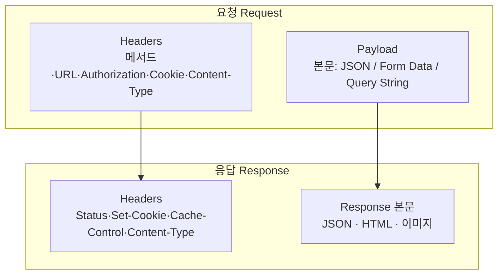

export const meta = {
  title: "DevTools Network 탭에서 요청과 응답 읽기",
  summary:
    "요청이 아예 안 나간 건지, 나갔는데 거절당한 건지. Network 탭의 Headers 와 Payload 를 읽는 순서.",
  date: "2026-07",
  role: "디버깅",
  tags: ["devtools", "http", "frontend", "debugging"],
};


로그인 버튼을 눌렀는데 화면이 그대로일 때가 있다. 코드를 몇 번 다시 읽어도 이상한 곳이 없고, 콘솔에도 빨간 줄 하나 뜨지 않는다. 눌렀다는 사실 말고는 아무 흔적이 없다.

여기서 답은 둘 중 하나다. 요청이 아예 안 나간 것인가, 나갔는데 서버가 거절한 것인가. 어느 쪽인지는 코드가 아니라 Network 탭을 열어야 나온다.

이 글은 F12 로 여는 Network 탭에서 Headers 와 Payload 를 어떤 순서로 읽는지를 정리한 것이다.

## 1. 목록에 줄이 수십 개 뜨면 어디부터 보나

Network 탭을 열어 두고 새로고침을 하면 줄이 수십 개 쏟아진다. 이미지, 폰트, 자바스크립트 파일, 그리고 그 사이 어딘가에 찾던 로그인 요청이 있다. 이 상태로는 어디부터 볼지 정할 수가 없다.

Network 탭은 페이지가 열려 있는 동안 브라우저가 주고받은 요청을 전부 기록한다. 목록의 줄 하나가 요청 하나다. 컬럼은 이렇게 읽으면 된다.

- **Name** — 요청한 파일 이름이나 API 경로
- **Status** — 서버가 돌려준 상태 코드
- **Type** — `xhr` · `fetch` · `document` · `img` 같은 요청의 종류
- **Initiator** — 이 요청을 일으킨 코드가 어디인지
- **Size** · **Time** — 받아 온 크기와 걸린 시간
- **Waterfall** — 언제 시작해서 언제 끝났는지를 그린 시간 막대

볼 건 API 요청 하나다. 목록 위쪽 필터에서 `Fetch/XHR` 만 켜면 이미지와 폰트가 통째로 빠지고 API 만 남는다. 이거 하나로 수십 줄이던 목록이 서너 줄이 된다.

## 2. 보낸 것과 받은 것을 가르는 기준

줄 하나를 클릭하면 오른쪽에 탭이 또 뜬다. Headers · Payload · Preview · Response · Initiator · Timing · Cookies.

Payload 와 Response 가 둘 다 JSON 을 보여주니 어느 쪽이 뭔지 매번 다시 확인하게 된다. 기준은 하나다. **Payload 는 브라우저가 보낸 것이고, Response 는 서버가 돌려준 것이다.**



Headers 는 요청과 응답에 딸려 다니는 메타데이터다. 누가 어떤 방식으로 어떤 형식으로 보냈는지가 적혀 있고, 내용물 자체는 여기 없다. Payload 는 요청에 실어 보낸 데이터, 그러니까 POST 의 본문이거나 GET 의 쿼리스트링이다. Response 는 서버가 돌려준 본문이다.

## 3. Headers 에는 뭐가 적혀 있나

Headers 탭은 세 덩어리로 나뉜다. 위에서부터 차례로 뜯어보자.

### General — 개요

```
Request URL:    https://api.example.com/api/auth/login
Request Method: POST
Status Code:    200 OK
Remote Address: 3.34.12.5:443
```

여기서는 `Status Code` 부터 본다. 이 숫자 하나로 1차 진단이 끝나는 경우가 꽤 많다.

`2xx` 는 성공, `301` 과 `302` 는 다른 주소로 넘어간 것, `304` 는 캐시를 다시 쓴 것, `401` 은 인증이 안 된 것, `403` 은 인증은 됐는데 권한이 없는 것, `404` 는 그런 주소가 없는 것, `5xx` 는 서버가 터진 것이다. `401` 과 `403` 을 구분해 두면 나중에 인증 문제를 볼 때 시간이 줄어든다. 앞엣것은 서버가 나를 알아보지 못한 것이고, 뒤엣것은 알아봤는데 이 작업은 안 된다고 한 것이다.

### Request Headers — 보낸 헤더

```
Authorization: Bearer eyJhbGci...
Cookie: access_token=...; refresh_token=...
Content-Type: application/json
Accept: application/json
```

인증이 안 될 때 제일 먼저 볼 자리가 여기다. `Authorization` 이나 `Cookie` 가 아예 비어 있으면 서버가 거절한 게 아니라 애초에 인증 정보를 안 보낸 것이다. 토큰을 헤더에 직접 싣는 방식이면 `Authorization: Bearer ...` 가 있어야 하고, 쿠키로 주고받는 방식이면 `Cookie` 줄에 쿠키 이름이 보여야 한다.

`Content-Type` 은 본문을 어떤 형식으로 보냈는지다. 이게 `application/json` 인데 실제로는 폼 데이터를 보내고 있으면 서버가 본문을 못 읽는다.

### Response Headers — 서버가 준 헤더

```
Set-Cookie: access_token=...; HttpOnly; Secure; SameSite=None
Content-Type: application/json
Cache-Control: no-store
X-Cache: Hit from cloudfront
```

`Set-Cookie` 는 서버가 브라우저에 쿠키를 심으라고 시키는 헤더다. 로그인이 성공했는데도 다음 요청에서 인증이 풀린다면 이 줄이 왔는지부터 본다. `Cache-Control` 은 이 응답을 캐시에 둬도 되는지를 정하고, `X-Cache` 는 CDN 을 거쳐 왔는지를 알려준다.

## 4. 그래서 보낸 데이터는 어디에 있나

Payload 탭이다. 다만 요청 방식에 따라 표시되는 모양이 다르다. 이 차이를 모르면 "왜 어떤 요청은 Payload 탭이 아예 없지" 에서 막힌다.

### GET 이면 Query String Parameters

```
GET /search?keyword=react&page=2
```

주소 뒤에 붙은 `?keyword=react&page=2` 를 브라우저가 알아서 쪼개 준다.

```
Query String Parameters
  keyword: react
  page:    2
```

### POST 나 PUT 으로 JSON 을 보내면 Request Payload

```json
{ "email": "a@b.com", "password": "***" }
```

`Content-Type: application/json` 이면 보낸 JSON 이 그대로 **Request Payload** 로 보인다.

### 폼으로 보내면 Form Data

`Content-Type: application/x-www-form-urlencoded` 인 경우다.

```
Form Data
  email: a@b.com
  password: ***
```

### 파일을 올리면 multipart/form-data

`Content-Type: multipart/form-data; boundary=...` 이고, 필드와 파일이 파트별로 나뉘어 보인다. 파일 자체는 크면 내용이 안 뜬다.

Payload 탭이 안 보인다고 뭔가 잘못된 것은 아니다. GET 에는 본문이 없어서 쿼리스트링만 뜨고, 본문이 아예 없는 요청은 Payload 탭 자체가 생기지 않는다.

## 5. 로그인 요청 하나를 통째로 펼쳐 보면

지금까지 나눠 본 것들이 실제로는 한 화면에 같이 있다. 로그인 요청 하나를 펼치면 이렇게 보인다.

```
▼ General
  Request URL:    https://api.example.com/api/auth/login
  Request Method: POST
  Status Code:    200 OK

▼ Request Headers
  Content-Type:  application/json
  Cookie:        access_token=eyJ...; refresh_token=eyJ...

▼ Payload (Request Payload)
  { "email": "user@example.com", "keepLogin": true }

▼ Response Headers
  Set-Cookie:    access_token=NEW...; HttpOnly; Secure; SameSite=None
  Content-Type:  application/json
  Cache-Control: no-store

▼ Response (본문)
  { "ok": true, "user": { "id": 42, "name": "홍길동" } }
```

이 한 화면에 네 가지가 다 들어 있다. 무엇을 보냈는지는 Payload 에, 인증 정보가 같이 실렸는지는 `Cookie` 에, 서버가 새 토큰을 심었는지는 `Set-Cookie` 에, 무엇을 돌려줬는지는 Response 에 있다.

쿠키 이름은 서비스마다 다르다. 여기서는 `access_token` 과 `refresh_token` 이라고 썼는데, 짧게 줄인 이름을 쓰는 곳도 많다. 이름이 뭐든 역할은 대체로 같다. 앞엣것은 지금 요청을 인증하는 데 쓰고, 뒤엣것은 앞엣것이 만료됐을 때 새로 받아 오는 데 쓴다.

## 6. 탭 위쪽 체크박스의 역할

눈에 잘 안 띄는 자리인데, 여기 있는 것들이 디버깅 시간을 제일 많이 줄여 준다.

- **Preserve log** — 페이지가 이동하거나 리다이렉트돼도 기록을 지우지 않는다. 로그인처럼 성공하자마자 다른 페이지로 넘어가는 요청은 이걸 안 켜면 기록이 사라져서 못 본다
- **Disable cache** — DevTools 가 열려 있는 동안 캐시를 무시하고 항상 새로 받는다
- **Throttling** — `Slow 3G` 같은 값을 골라 느린 네트워크를 흉내 낸다
- **Copy → Copy as cURL / Copy as fetch** — 요청 하나를 터미널 명령이나 코드로 그대로 복사한다. 버그 리포트에 붙이면 받는 사람이 똑같이 재현할 수 있다
- **HAR export** — 네트워크 기록 전체를 파일로 저장해 남에게 넘긴다
- **Initiator** — 이 요청을 일으킨 코드 위치를 따라간다
- **Timing** — TTFB, Waiting, Content Download 로 나눠 어디서 시간을 쓰는지 본다

목록 색깔도 정보다. 빨간 줄은 실패한 요청이고, 회색은 `304` 처럼 캐시를 다시 쓴 요청이다. Size 칸에 `(from disk cache)` 나 `(from memory cache)` 라고 적혀 있으면 네트워크를 아예 안 탄 것이다.

## 그래서 로그인은 왜 안 됐나

요청이 안 나간 건지 서버가 거절한 건지는 Network 탭을 열면 5초 만에 알 수 있다. 목록에 줄이 없으면 안 나간 것이고, 줄이 있는데 `401` 이면 나갔는데 거절당한 것이다.

화면이 이상할 때 코드부터 다시 읽는 것은 순서가 뒤다. F12 를 누르고 `Fetch/XHR` 필터를 켠 다음, Status 를 보고, Request Headers 에 인증 정보가 실렸는지를 본다. 코드에 `console.log` 를 심어 가며 찾는 값이 대부분 여기 이미 적혀 있다.

로그인 버튼을 누르고 화면만 보고 있는 상황이라면, 일단 F12 부터 눌러 보면 좋겠다. 코드에 없는 답이 거기 적혀 있을 때가 많다.

## Related

- [로그인 상태는 세션과 쿠키로 어떻게 유지되나](/cases/session-cookie-login)
- 인증·인가 & Bearer 헤더 방식
- [CDN 은 어떻게 가까운 데서 파일을 내주나](/cases/cdn-edge-delivery)
