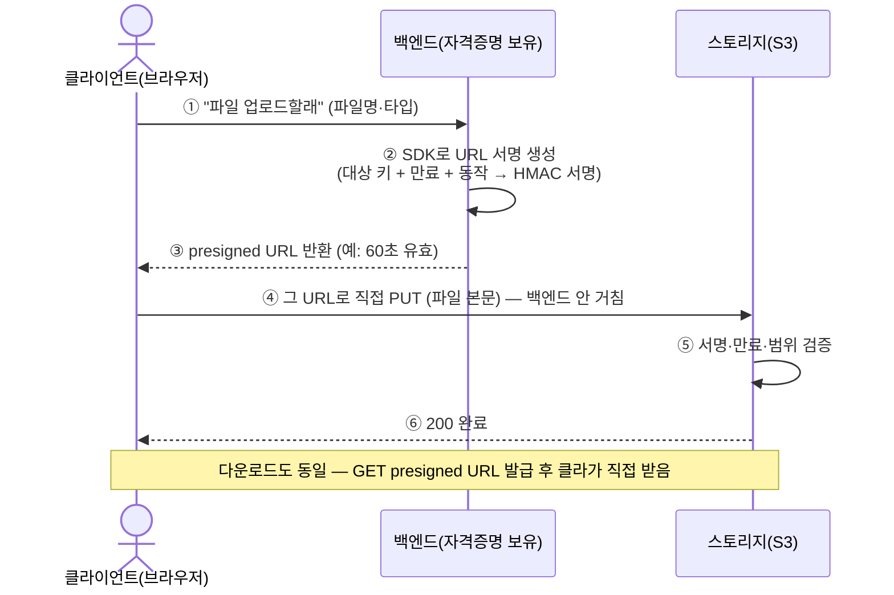

export const meta = {
  title: "Presigned URL로 비공개 파일 업로드·다운로드하기",
  summary: "서버가 서명한 URL로 스토리지에 직접 접근하는 원리를 설명한다. 허용할 동작과 만료 시간, 업로드 조건을 정할 때의 주의점도 다룬다.",
  date: "2026-07",
  role: "스토리지",
  tags: ["presigned-url", "storage", "security", "frontend"],
};


비공개로 잠가 둔 스토리지에서 파일 하나를 받는 링크는 주소가 화면 두 줄을 넘어간다. 끝에는 `X-Amz-Signature=3f9a...` 같은 것이 붙어 있다. 그 주소를 브라우저 주소창에 그대로 붙여 넣으면 파일이 내려온다. 로그인도 하지 않았고 토큰을 헤더에 넣지도 않았는데 그렇다.

브라우저에서 별도로 로그인하지 않아도 URL에 포함된 서명으로 파일에 접근한다.

Presigned URL의 파라미터가 어떤 권한을 나타내는지 살펴본다. 업로드에 사용하는 방법과 URL이 유출됐을 때의 위험도 함께 정리했다.

## 1. 파일을 스토리지에 직접 전송하는 이유

먼저 용어부터 정리한다. 처음 보면 여기서 이미 막힌다.

**S3** 는 AWS 가 파는 파일 저장소다. **버킷(bucket)** 은 그 안에 만드는 보관함 하나를 가리킨다. 폴더라고 생각해도 크게 틀리지 않는다. 버킷은 기본이 비공개다. 아무나 주소를 알아도 파일을 못 받는다.

**자격증명(credential)** 은 access key ID 와 secret access key 한 쌍이다. AWS 를 쓰는 아이디·비밀번호에 해당한다. 이걸 가진 쪽은 그 계정이 허용한 모든 걸 할 수 있다. 버킷 하나만 읽는 게 아니라 지우는 것도 포함해서.

그래서 "브라우저가 비공개 버킷의 파일을 다뤄야 한다"는 요구가 생기면 방법이 마땅치 않다. 흔히 떠오르는 세 가지는 각각 이런 문제가 있다.

| 방법                              | 무슨 일이 생기나                                                                                           |
| --------------------------------- | ---------------------------------------------------------------------------------------------------------- |
| 버킷을 public 으로 열어 둔다      | 주소를 아는 누구나 받아 간다. 검색엔진에 걸리기도 한다                                                     |
| 서버가 중간에서 받아 되전달한다   | 100MB 파일 하나가 올라오는 동안 서버 메모리와 대역폭을 그만큼 붙잡는다. 동시에 열 명이 올리면 열 배가 된다 |
| 클라이언트에 자격증명을 넣어 준다 | 브라우저에 내려간 값은 개발자 도구로 다 보인다. 키가 새면 스토리지 전체를 잃는다                           |

표 1. 브라우저가 비공개 버킷을 다루는 세 가지 방법과 그 문제

서버가 중간에서 검사도 해 주니 더 나아 보인다. 그런데 파일이 클수록 서버는 아무 계산도 안 하면서 그냥 바이트를 받아 다시 뱉는 일에만 자원을 쓴다. 값도 그만큼 나간다.

Pre-signed URL 은 이 셋을 한 번에 피한다. 버킷은 비공개로 두고, 파일은 브라우저와 스토리지 사이에서 직접 오가고, 자격증명은 서버 밖으로 나가지 않는다. 클라이언트가 받는 건 자격증명이 아니라 **시간이 정해진 URL 하나**다.

## 2. Presigned URL의 구성

이런 URL 을 pre-signed URL 이라고 한다. 서버가 자기 자격증명으로 미리 서명해 둔 주소라는 뜻이다. 실물은 이렇게 생겼다.

```
https://my-bucket.s3.ap-northeast-2.amazonaws.com/uploads/a.png
  ?X-Amz-Algorithm=AWS4-HMAC-SHA256
  &X-Amz-Credential=...
  &X-Amz-Date=20260729T060000Z
  &X-Amz-Expires=60                 ← 60초 뒤 만료
  &X-Amz-SignedHeaders=host
  &X-Amz-Signature=3f9a...          ← 서명(위변조 시 거부)
```

앞쪽 절반은 평범하다. 버킷 이름, 리전, 그리고 `uploads/a.png` 라는 파일 경로. S3 는 이 경로를 **키(key)** 라고 부른다. 물음표 뒤가 전부 서명 관련이다. 언제 만든 요청인지(`X-Amz-Date`), 몇 초 동안 유효한지(`X-Amz-Expires`), 누가 서명했는지(`X-Amz-Credential`), 그리고 서명값 자체(`X-Amz-Signature`).

놀이공원 티켓에 비유하면 이해가 빠르다. 정문 마스터키를 남에게 넘기는 대신 "오늘 3시까지, 롤러코스터 한 번만" 이 찍힌 티켓을 끊어 주는 것이다. 시간이 지났거나 다른 기구 앞에 내밀면 거부당한다. Pre-signed URL 이 그 티켓이다.

## 3. 서명된 URL로 업로드하는 과정

여기가 제일 안 풀리는 자리다. 티켓 비유까지는 따라오는데 티켓을 검사하는 직원이 어디 있는지가 보이지 않는다. 서버는 URL 을 만들어 주고 빠졌는데, 브라우저가 S3 로 직접 쏘는 요청은 누가 확인하는가.

확인하는 쪽은 S3 다. 서명을 만드는 건 서버고, 검사하는 건 스토리지다. 둘은 서로 통신하지 않는다. 같은 계산을 각자 한 번씩 할 뿐이다.



서버 쪽에서 일어나는 일은 이렇다. 요청의 내용을 정해진 형식으로 한 줄기 문자열로 늘어놓고, 그걸 secret access key 로 HMAC-SHA256 해싱한다. 나온 결과가 `X-Amz-Signature` 에 박히는 값이다.

S3 쪽은 그 반대다. 요청이 들어오면 `X-Amz-Credential` 에 적힌 access key ID 를 보고 자기가 가진 같은 secret 을 꺼낸다. 그리고 방금 들어온 요청으로 서버가 했던 계산을 그대로 다시 한다. 나온 값이 URL 에 실려 온 서명과 같으면 통과다.

여기서 두 가지가 중요하다.

**첫째, secret 은 어디에도 실려 가지 않는다.** URL 에 들어 있는 건 계산 결과뿐이다. 해시 결과에서 원래 키를 되돌릴 방법이 없으니, URL 을 백 개 모아도 자격증명은 나오지 않는다. "자격증명을 노출하지 않는다"는 말이 이 뜻이다.

**둘째, 파라미터를 하나라도 고치면 서명이 깨진다.** 만료 시각도 서명 계산에 들어가는 값이라 `X-Amz-Expires=60` 을 `=6000` 으로 바꿔 적으면 계산 결과가 달라져서 거부된다. 파일 경로를 다른 사람 파일로 바꿔도 마찬가지다.

원리 자체는 로그인 토큰(JWT)에 쓰는 것과 같다. 서명과 만료로 위변조를 막는다는 발상이 동일하고, 대상이 토큰이 아니라 URL 일 뿐이다.

하나 더. Pre-signed URL 은 없던 권한을 만들어 주지 않는다. **서명에 쓴 자격증명이 원래 못 하는 일은 URL 로도 못 한다.** 서버 계정에 그 버킷 쓰기 권한이 없으면 아무리 서명해도 S3 가 거부한다. 빌려주는 것이지 새로 만드는 게 아니다.

## 4. 서명에 포함되는 요청 정보

이건 나중에 나올 비용과 직접 이어지는 부분이라 따로 떼어 둔다.

서명 계산에 들어가는 것부터.

- **HTTP 메서드** — GET 으로 서명한 URL 로 PUT 을 시도하면 거부된다
- **버킷과 키** — 지정한 그 파일 하나에만 쓸 수 있다
- **만료 시각과 유효 기간**
- **`X-Amz-SignedHeaders` 에 이름이 적힌 헤더의 값** — 기본은 `host` 다. 서명할 때 `Content-Type` 을 지정했다면 그것도 여기 들어간다

빠지는 게 하나 있다. **파일 본문이다.** Pre-signed URL 은 본문을 서명 대상에서 뺀 채로 만들어진다. 요청의 모양만 서명하고 실제로 실려 오는 바이트는 서명하지 않는다는 뜻이다.

그래서 서명이 통과했다는 건 "약속한 자리에, 약속한 시간 안에, 약속한 동작으로 요청이 왔다"는 확인이지 "올바른 파일이 왔다"는 확인이 아니다. `Content-Type: image/png` 로 서명해 두면 클라이언트는 그 헤더를 똑같이 보내야 한다. 하지만 그건 헤더 문자열이 일치한다는 뜻이다. 실려 온 바이트가 진짜 PNG 라는 확인은 아무 데서도 하지 않는다.

이 구분을 놓치는 것이 pre-signed URL 에서 가장 흔한 오해다.

## 5. 업로드·다운로드 구현 예시

AWS SDK for JavaScript v3 기준이다.

### 다운로드 URL (GET)

```ts
import { S3Client, GetObjectCommand } from "@aws-sdk/client-s3";
import { getSignedUrl } from "@aws-sdk/s3-request-presigner";

const s3 = new S3Client({ region: "ap-northeast-2" });

// 백엔드에서 발급
const downloadUrl = await getSignedUrl(
  s3,
  new GetObjectCommand({ Bucket: "my-bucket", Key: "files/resume.pdf" }),
  { expiresIn: 300 }, // 5분
);
// 클라이언트는 그냥 이 URL로 GET (또는 <a href>)
```

`expiresIn` 은 초 단위다. 300 이면 5분. 이 코드는 반드시 백엔드에서 돈다. 프런트에서 돌리려면 `S3Client` 에 자격증명을 넣어야 하고, 그 순간 3번째 나쁜 방법이 된다.

### 업로드 URL (PUT)

```ts
// 백엔드
const uploadUrl = await getSignedUrl(
  s3,
  new PutObjectCommand({
    Bucket: "my-bucket",
    Key: "uploads/a.png",
    ContentType: "image/png",
  }),
  { expiresIn: 60 },
);
```

```ts
// 클라이언트 — 받은 URL로 직접 PUT
await fetch(uploadUrl, {
  method: "PUT",
  body: file,
  headers: { "Content-Type": file.type }, // 서명 때 지정한 ContentType과 일치해야 함
});
```

주석에 적힌 그대로다. 서명할 때 `ContentType: 'image/png'` 를 넣었으면 클라이언트도 `Content-Type: image/png` 를 보내야 한다. 문자열이 다르면 서명 계산 결과가 달라져서 거부된다. 여기서 막히는 사람이 많다.

### 조건을 걸어야 할 때 — Presigned POST

PUT 방식은 크기 제한을 걸 수가 없다. 서명은 "이 키에 PUT 해도 된다"까지만 말하고 몇 바이트인지는 관여하지 않는다. 조건을 걸려면 다른 걸 쓴다.

```ts
import { createPresignedPost } from "@aws-sdk/s3-presigned-post";

const { url, fields } = await createPresignedPost(s3, {
  Bucket: "my-bucket",
  Key: "uploads/${filename}",
  Conditions: [["content-length-range", 0, 5_000_000]], // 최대 5MB
  Expires: 60,
});
```

```ts
// 클라: fields + 파일을 FormData로 묶어 POST
const form = new FormData();
Object.entries(fields).forEach(([k, v]) => form.append(k, v as string));
form.append("file", file);
await fetch(url, { method: "POST", body: form });
```

`Conditions` 에 적은 것들이 정책 문서로 묶여 서명되고, S3 가 업로드를 받는 시점에 그 조건을 검사한다. `content-length-range` 로 5MB 상한을 걸면 5MB 를 넘는 요청은 S3 가 거부한다. 서버가 검사하는 게 아니라 S3 가 검사한다는 게 요점이다.

### 프런트에서의 전형적인 순서

1. 사용자가 파일을 고른다 → 프런트가 백엔드에 "URL 하나 주세요" 라고 요청한다
2. 백엔드가 로그인 여부·권한을 확인한 뒤 URL 을 발급한다
3. 프런트가 그 URL 로 S3 에 직접 올린다
4. 다 올라가면 백엔드에 "이 키에 저장했다"고 알린다

2번의 권한 확인이 진짜 인증이 일어나는 유일한 지점이다. 그 뒤로는 URL 이 알아서 통과한다.

## 6. URL 만료 시간 정하기

`expiresIn` 에 무엇을 넣을지가 실질적으로 이 기능에서 제일 중요한 결정이다. 이 숫자를 무엇을 보고 정하는지부터 보자.

상한부터. AWS Signature Version 4 로 만든 pre-signed URL 의 최대 유효 기간은 **7일(604800초)** 이다. 그보다 크게 적으면 SDK 가 거부한다.

그런데 실제로는 그보다 훨씬 빨리 죽는 경우가 흔하다. **임시 자격증명으로 서명한 URL 은 그 자격증명이 만료되는 순간 같이 만료된다.** EC2 인스턴스 역할이나 Lambda 실행 역할로 서명하면 대개 이쪽이다. `expiresIn` 에 7일을 적어 두고도 다음 날 안 되는 상황이 여기서 나온다.

값을 정하는 기준은 하나다. **URL 이 새어 나갔을 때 남이 쓸 수 있는 시간이 곧 그 값이다.** 업로드는 60초에서 몇 분, 다운로드도 몇 분 정도로 잡는다. 사용자가 파일을 고르고 나서 요청하면 되니까 미리 길게 발급해 둘 이유가 없다.

만료 판정은 요청이 S3 에 도착한 시점을 기준으로 한다. 그래서 만료 직전에 시작한 대용량 업로드가 전송 도중에 끊기지는 않는다고 알려져 있다. 다만 이 부분은 직접 측정하지 못했다. 시간이 빠듯한 상황을 일부러 만들지 않는 편이 낫다.

## 7. Presigned URL 사용 시 주의점

장점만 보면 안 쓸 이유가 없어 보이는데, 실제로는 서버가 하던 일 몇 가지를 같이 내려놓는 거래다.

| 포기하는 것                           | 왜 그렇게 되나                                                                  |
| ------------------------------------- | ------------------------------------------------------------------------------- |
| **발급한 URL 을 취소하는 방법**       | S3 는 그 URL 을 언제 발급했는지 기록하지 않는다. 서명이 맞고 시간 안이면 통과다 |
| **올라온 파일의 내용 검사**           | 본문이 서명 대상에 없다(4절). 서버는 바이트를 아예 보지 못한다                  |
| **업로드 성공 여부를 서버가 아는 것** | 전송이 서버를 거치지 않으니 S3 가 200 을 준 사실을 서버는 모른다                |
| **PUT 방식에서의 크기 제한**          | 조건을 걸려면 Presigned POST 로 바꿔야 한다                                     |

표 2. Pre-signed URL 로 옮기면서 내려놓는 것 네 가지

첫 줄이 제일 무겁다. **한번 만들어 준 URL 은 만료 전까지 되돌릴 수 없다.** URL 자체가 통행권이라 그걸 가진 사람이 누구든 상관하지 않는다. 그래서 URL 이 접근 로그에 찍히거나, `Referer` 헤더로 다른 사이트에 흘러가거나, 사용자가 채팅방에 붙여 넣으면 그 시간 동안은 아무나 쓸 수 있다. 굳이 막으려면 파일을 지우거나 버킷 정책을 바꾸거나 서명에 쓴 키를 폐기해야 하는데, 셋 다 다른 URL 들까지 같이 죽인다. 현실적인 완화는 만료를 짧게 잡는 것뿐이다.

두 번째와 세 번째는 짝이다. 서버는 무엇이 올라왔는지도, 올라오긴 했는지도 모른다. 클라이언트가 "다 올렸어요" 하고 알려 주는 4단계를 믿는 구조인데, 그 알림은 클라이언트가 거짓으로 보낼 수도 있고 브라우저가 닫혀서 안 올 수도 있다. 제대로 하려면 S3 이벤트 알림을 받아 서버가 직접 확인하고, 바이러스 검사나 이미지 여부 검사도 업로드가 끝난 뒤에 따로 돌려야 한다. 서버 프록시 방식이 공짜로 주던 걸 다시 만들어 붙이는 셈이다.

여기 하나 더 붙는다. **키 이름을 클라이언트가 정하게 두면 안 된다.** 프런트가 보낸 파일명을 그대로 키로 써서 서명하면, 남이 쓴 키를 지정해 덮어쓸 수 있다. 키는 서버가 만들고, 사용자 원래 파일명은 따로 저장한다.

## 8. 요청 실패 시 확인할 항목

- **403 SignatureDoesNotMatch** — 만료됐거나, 서명 파라미터와 실제 요청이 다르다. 서버 시계가 틀어져 있어도(clock skew) 난다. NTP 부터 본다
- **CORS 에러** — 브라우저에서 S3 로 직접 쏘는 거라 버킷 CORS 설정에 해당 origin 과 메서드(PUT/POST)가 허용돼 있어야 한다. 이게 빠지면 브라우저는 요청을 보내지도 않고 막는다
- **Content-Type 불일치** — 5절에서 말한 그것. 서명할 때 값과 `fetch` 헤더 값이 한 글자라도 다르면 안 된다
- **HTTPS 를 안 쓴 경우** — URL 자체가 통행권이라 평문으로 오가면 중간에서 그대로 주워 갈 수 있다

최소 권한도 같이 챙긴다. 서명에 쓰는 IAM 자격증명은 해당 버킷과 prefix, 필요한 동작으로만 좁혀 둔다. 3절에서 말했듯 URL 은 그 자격증명이 가진 권한을 빌려주는 것이라, 자격증명이 넓으면 실수 하나로 넓은 URL 이 나간다.

## URL에 부여한 권한 확인하기

그 URL 은 이미 인증을 통과한 결과물이다. 서버가 자기 자격증명으로 딱 그 파일, 딱 그 동작, 딱 그 시간만큼을 서명해 둔 것이고, S3 는 그 계산을 다시 해서 맞는지만 본다.

이 구조를 알고 나면 pre-signed URL 에서 볼 곳이 정해진다. 만료가 몇 초인지, 무슨 동작으로 서명됐는지, 키를 서버가 정했는지 클라이언트가 정했는지. 이 세 항목을 확인하면 URL이 유출됐을 때 허용되는 접근 범위를 파악하는 데 도움이 된다.

## 관련 글

- [JWT의 구조와 서명 검증 원리](/cases/jwt-signature)
- [쿠키와 세션으로 로그인 상태를 유지하는 원리](/cases/session-cookie-login)
