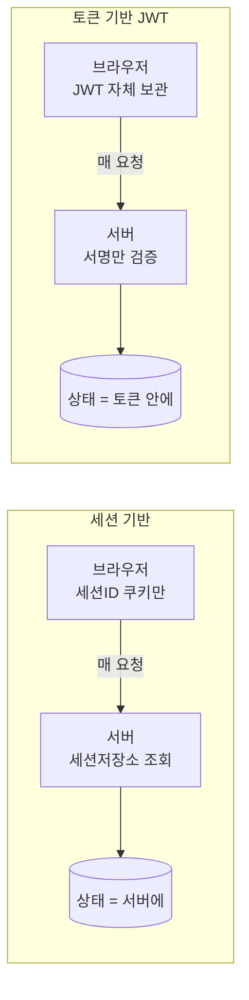

export const meta = {
  title: "로그인 상태는 세션과 쿠키로 어떻게 유지되나",
  summary:
    "요청은 매번 새로 나가는데 서버는 어떻게 매번 같은 사람으로 알아보나. 재료는 쿠키와 세션 둘뿐이다.",
  date: "2026-07",
  role: "인증",
  tags: ["authentication", "session", "cookie", "security", "login"],
};


로그인 화면에서 아이디와 비밀번호를 넣고 버튼을 누른다. 마이페이지로 넘어간다. 새로고침을 해도, 다른 메뉴로 들어가도, 탭을 닫았다 다시 열어도 여전히 로그인한 상태다. 로그인은 한 번뿐이었는데 서버는 그 뒤로 계속 같은 사람으로 알아본다.

로그인을 처음 붙여 볼 때 제일 이상하게 보이는 자리가 여기다. 요청은 매번 새로 나가는데 서버는 어떻게 매번 같은 사람으로 알아보는가.

이 글은 그 질문 하나에 답한다. 답의 재료는 두 개뿐이다. 쿠키와 세션.

읽는 사람으로는 로그인을 처음 붙여 보는 개발자를 생각하고 썼다. 인증을 다뤄 본 적이 없어도 읽을 수 있게 정리했다.

## 1. 서버는 왜 매번 처음 보는 사람 취급을 하나

먼저 인정하고 갈 것이 있다. **HTTP 는 무상태(stateless)** 다. 요청 하나를 받아서 응답 하나를 돌려주면 그걸로 끝이고, 서버는 방금 누구를 상대했는지 다음 요청에서 기억하지 않는다.

여기서 오해가 생긴다. 서버에 접속해 있는 동안은 서버가 그 사용자를 계속 붙잡고 있다고 보기 쉬운데, 그런 연결은 없다. `POST /login` 과 그다음에 나가는 `GET /mypage` 는 서버 입장에서 아무 관계도 없는 요청 두 개다.

> 🎢 놀이공원에 기억상실증 직원이 있다고 하자. 매표소에서 표를 사도 놀이기구 앞에 가면 "당신 누구세요, 표 샀어요?"라고 매번 묻는다. 이걸 풀려면 **손목밴드**를 채워 주고, 직원은 **손목밴드 번호와 손님 정보를 적어 둔 장부**를 보면 된다. 손목밴드가 쿠키고 장부가 세션이다.

## 2. 쿠키는 누가 붙이는 걸까

쿠키는 서버가 브라우저에 저장시키는 작은 데이터 조각이다. 한번 저장되면 브라우저가 **같은 도메인으로 가는 모든 요청에 알아서 붙여서** 보낸다.

```
서버 → 브라우저 (응답):   Set-Cookie: sid=abc123
브라우저 → 서버 (이후 모든 요청): Cookie: sid=abc123    ← 자동 첨부
```

여기가 제일 헷갈리는 자리다. 프론트엔드 코드가 요청마다 쿠키를 챙겨서 붙인다고 보기 쉬운데 아니다. **브라우저가 붙인다.** 개발자가 시키지 않아도 붙고, 심지어 개발자가 모르는 요청에도 붙는다.

이 자동 첨부가 쿠키의 가장 큰 편의이면서, 뒤에 나올 CSRF 라는 공격이 성립하는 이유이기도 하다. 지금은 "브라우저가 알아서 붙인다"만 기억하면 된다.

크기는 4KB 정도로 작고, 도메인과 경로와 만료 규칙에 따라 어떤 요청에 실릴지가 정해진다. 그 규칙이 5절에 나오는 쿠키 속성이다.

## 3. 그럼 서버는 무엇을 들고 있나

세션은 서버 쪽에 두는 사용자별 상태다. 로그인한 사람마다 고유한 **세션 ID** 를 하나 발급하고, 그 ID 로 "이 사람은 userId=42, 권한은 admin" 같은 정보를 서버가 기억한다.

```
[서버의 세션 저장소]   (메모리 / Redis / DB)
 sid=abc123  →  { userId: 42, role: "admin", loginAt: ... }
 sid=xyz789  →  { userId: 99, role: "user" }
```

저장 위치는 서버 메모리여도 되지만, 그러면 서버를 재시작할 때마다 모두가 로그아웃된다. 그래서 보통은 Redis 같은 공유 저장소에 둔다.

여기서 중요한 게 하나 있는데, 브라우저가 들고 있는 건 **세션 ID 뿐**이라는 것이다. 실제 신원 정보는 서버에 있고, `abc123` 이라는 문자열만 봐서는 그게 누구인지 알 수 없다. 물론 훔친 사람이 그 값을 그대로 보내면 그 사용자인 척할 수 있는데, 그 문제는 8절에서 다룬다.

## 4. 로그인부터 로그아웃까지 무슨 일이 일어나는가

핵심은 이 한 줄이다. **신원 정보는 서버에 두고, 그걸 여는 열쇠인 세션 ID 만 쿠키에 담는다.**

```mermaid
sequenceDiagram
    actor U as 사용자(브라우저)
    participant S as 서버
    participant DB as 세션 저장소(Redis)

    U->>S: ① POST /login (id, pw)
    S->>S: 자격 검증 (비번 확인)
    S->>DB: ② 세션 생성 sid=abc123 → {userId:42}
    S-->>U: ③ 200 OK + Set-Cookie: sid=abc123; HttpOnly; Secure; SameSite=Lax
    Note over U: 브라우저가 쿠키 자동 저장

    U->>S: ④ GET /mypage (Cookie: sid=abc123 자동첨부)
    S->>DB: ⑤ sid=abc123 조회
    DB-->>S: {userId:42}
    S-->>U: ⑥ 200 OK (userId 42의 마이페이지)

    U->>S: ⑦ POST /logout
    S->>DB: 세션 삭제
    S-->>U: Set-Cookie: sid=; Max-Age=0  (쿠키 만료 지시)
    Note over U: 이후엔 다시 로그인 필요
```

①~③ 이 로그인이고, 서버가 비밀번호를 확인한 다음 세션을 만들어 그 세션 ID 를 쿠키로 심어 준다.

④~⑥ 이 그 뒤의 모든 요청이다. 브라우저가 쿠키를 자동으로 붙이고, 서버는 세션 ID 로 저장소를 뒤져 신원을 복원한다. 1절에서 말한 무상태를 여기서 넘어선다. 서버가 기억력을 얻은 게 아니라, 요청마다 신원을 다시 조회하는 것이다.

⑦ 이 로그아웃인데, 서버에서 세션을 지우는 것과 쿠키를 만료시키는 것을 같이 한다. **둘 다 해야 한다.** 쿠키만 지우면 서버 세션은 살아 있고, 세션만 지우면 브라우저는 죽은 ID 를 계속 보낸다.

### 실제로 오가는 것

로그인 응답은 이렇게 생겼다.

```http
POST /login  →  응답:
HTTP/1.1 200 OK
Set-Cookie: sid=abc123; HttpOnly; Secure; SameSite=Lax; Path=/; Max-Age=3600
```

그다음 요청은 이렇다. 이 `Cookie` 줄은 애플리케이션 코드가 쓴 게 아니라 브라우저가 넣은 것이다.

```http
GET /mypage HTTP/1.1
Cookie: sid=abc123
```

서버 코드는 Express 와 express-session 기준으로 이 정도다.

```js
// 로그인
app.post("/login", (req, res) => {
  const user = verify(req.body.id, req.body.pw); // 자격 검증
  req.session.userId = user.id; // ← 세션에 신원 저장
  // express-session이 Set-Cookie: connect.sid=... 를 자동으로 내려줌
  res.json({ ok: true });
});

// 인증이 필요한 라우트
app.get("/mypage", (req, res) => {
  if (!req.session.userId) return res.status(401).end(); // 쿠키의 세션ID로 복원됨
  res.json({ userId: req.session.userId });
});
```

프런트엔드에서 한 군데 걸리는 데가 있다. API 서버 도메인이 프론트와 다르면 `fetch` 가 쿠키를 안 보낸다. `credentials: 'include'` 를 줘야 실린다.

```js
fetch("https://api.example.com/mypage", { credentials: "include" });
```

## 5. 쿠키 속성 하나로 보안이 달라진다

`Set-Cookie` 에 붙는 옵션들이다. 로그인 쿠키는 이걸 제대로 줘야 안전하다.

| 속성                  | 뜻                                                         | 왜 중요한가                                                   |
| --------------------- | ---------------------------------------------------------- | ------------------------------------------------------------- |
| **HttpOnly**          | JS(`document.cookie`)에서 접근 불가                        | XSS 로 세션 쿠키를 훔쳐 가는 것을 막는다 (스크립트가 못 읽음) |
| **Secure**            | HTTPS에서만 전송                                           | 네트워크 도청으로 쿠키가 새는 것을 막는다                     |
| **SameSite**          | 다른 사이트발 요청에 쿠키를 붙일지 (`Strict`/`Lax`/`None`) | CSRF 를 막는다. `Lax` 가 모던 기본. `None` 은 `Secure` 필수   |
| **Domain**            | 쿠키가 유효한 도메인                                       | 서브도메인 공유 범위를 정한다 (`.example.com`)                |
| **Path**              | 유효한 경로                                                | 경로 범위를 제한한다                                          |
| **Max-Age / Expires** | 만료 시각                                                  | 없으면 "세션 쿠키"가 되어 브라우저를 닫을 때 삭제된다         |

표 1. 로그인 쿠키에 붙이는 `Set-Cookie` 속성

로그인 세션 쿠키라면 `HttpOnly; Secure; SameSite=Lax` 를 기본으로 두고, 서브도메인끼리 공유해야 하면 `Domain` 을 더한다.

`HttpOnly` 는 이름이 오해를 부른다. HTTP 로만 보낸다는 뜻으로 읽히는데, 그건 `Secure` 쪽 이야기다. `HttpOnly` 는 자바스크립트가 못 읽게 막는다는 뜻이다.

## 6. 트레이드오프

여기까지만 보면 세션 방식이 깔끔해 보인다. 실제로는 서버가 부담을 진다.

**서버가 상태를 들고 있어야 한다.** 로그인한 사용자 수만큼 세션이 저장소에 쌓인다. 사용자가 늘면 그만큼 메모리나 저장소가 필요하고, 만료된 세션을 치우는 일도 서버 몫이다.

**서버를 여러 대로 늘리면 문제가 생긴다.** 서버 A 에서 로그인해 세션이 A 의 메모리에 저장됐는데, 다음 요청이 로드밸런서를 거쳐 서버 B 로 가면 B 는 그 세션 ID 를 모른다. 사용자는 갑자기 로그아웃된 것처럼 보인다. 풀려면 세 가지 중 하나를 골라야 한다. 같은 사용자를 늘 같은 서버로 보내거나(sticky session), 세션을 Redis 같은 공유 저장소로 빼거나, 아예 세션을 안 쓰거나.

**공유 저장소가 새로운 단일 장애점이 된다.** Redis 로 빼면 확장 문제는 풀리는데, 이번엔 Redis 가 죽으면 전 서비스가 한꺼번에 로그아웃된다. 그리고 요청마다 저장소를 한 번씩 더 조회한다.

이 부담을 없애려고 나온 것이 토큰 방식이다. 상태를 서버가 아니라 토큰 안에 넣어서, 서버는 저장하지 않고 검증만 하게 만든다.

## 7. 그럼 JWT 는 뭐가 다른가

쿠키와 세션이 유일한 방법은 아니다. 나뉘는 지점은 하나다. **상태를 어디에 두느냐.**



|                  | 세션 기반(쿠키+세션)                               | 토큰 기반(JWT)                                             |
| ---------------- | -------------------------------------------------- | ---------------------------------------------------------- |
| 상태 저장        | **서버**(stateful)                                 | **토큰 자체**(stateless)                                   |
| 무효화(로그아웃) | 쉽다. 서버에서 세션을 지우면 끝                    | 어렵다. 만료 전까진 유효해서 블랙리스트가 따로 필요하다    |
| 확장성           | 공유 세션 저장소(Redis)가 필요하다                 | 서버가 검증만 하니 수평 확장이 쉽다                        |
| 저장 부담        | 사용자 수만큼 서버가 저장한다                      | 서버 저장이 없다                                           |
| 노출 위험        | 세션ID만 새는데, 그 값만으로는 누구인지 알 수 없다 | 페이로드가 base64 로 **읽힌다**. 민감정보를 넣으면 안 된다 |
| 크기             | 작다                                               | 크다. 매 요청에 실려 나간다                                |

표 2. 세션 기반과 토큰 기반(JWT)의 비교

어느 쪽이 낫다기보다 6절의 대가와 이 표의 무효화 항목을 맞바꾸는 것에 가깝다. 그래서 실무에선 섞기도 한다. JWT 를 `HttpOnly` 쿠키에 담으면 쿠키의 안전성과 토큰의 무상태성을 절반씩 가져갈 수 있다.

## 8. 무엇이 세션을 노리는가

5절의 쿠키 속성이 왜 필요한지는 공격 쪽에서 보면 더 분명하다.

| 위협                    | 무엇을 하는가                                                                      | 무엇으로 막는가                                       |
| ----------------------- | ---------------------------------------------------------------------------------- | ----------------------------------------------------- |
| **XSS (쿠키 탈취)**     | 주입된 스크립트가 `document.cookie` 로 세션ID를 읽어 간다                          | `HttpOnly` 로 JS 접근을 막고, 입력을 이스케이프한다   |
| **CSRF**                | 로그인된 브라우저를 속여 의도치 않은 요청을 보내게 한다. 쿠키 자동 첨부를 악용한다 | `SameSite` + CSRF 토큰                                |
| **세션 하이재킹**       | 세션ID를 도청하거나 훔쳐서 그 사람인 척한다                                        | `Secure`(HTTPS) + 짧은 만료 + 로그인 시 재발급        |
| **세션 고정(fixation)** | 공격자가 미리 심어 둔 세션ID로 피해자가 그대로 로그인하게 만든다                   | 로그인에 성공할 때 세션ID를 새로 발급한다(regenerate) |

표 3. 세션을 노리는 위협과 막는 방법

CSRF 는 2절에서 말한 자동 첨부가 그대로 공격 통로가 되는 경우다. 브라우저는 요청이 어느 사이트에서 시작됐는지 따지지 않고 쿠키를 붙이니, 공격자 페이지에서 보낸 요청에도 로그인 쿠키가 실린다. 이건 쿠키 속성만으로 다 막히지 않아서 별도의 토큰이 필요한데, 그건 [CSRF 토큰 로그인 인증에서 프론트엔드의 역할](/cases/csrf-token-frontend)에서 따로 다룬다.

## 마무리

요청은 매번 새로 나가는데 서버가 매번 같은 사람으로 알아보는 이유는, 요청마다 신원을 다시 조회하기 때문이다. 쿠키에 담긴 세션 ID 를 브라우저가 자동으로 붙이고, 서버는 그 ID 로 저장소에서 신원을 꺼낸다. HTTP 의 무상태를 없앤 게 아니라 매 요청 조회로 덮은 것이다.

이 구조를 보고 나면 `HttpOnly` 나 `SameSite` 는 외울 항목이 아니게 된다. 쿠키를 브라우저가 알아서 붙인다는 사실 하나에서 XSS 와 CSRF 가 둘 다 따라 나오고, 그 둘을 막는 게 저 속성들이다.

지금 로그인을 처음 붙이는 중이라면 순서를 이렇게 잡기를 권한다. 세션 저장소를 Redis 로 먼저 빼 두고, 쿠키는 `HttpOnly; Secure; SameSite=Lax` 로 시작하고, 로그인에 성공할 때 세션ID 재발급만 빠뜨리지 않는다. 나머지는 필요해질 때 붙여도 늦지 않다.

## Related

- [CSRF 토큰 로그인 인증에서 프론트엔드의 역할](/cases/csrf-token-frontend)
- [JWT 는 왜 내용이 다 보이는데도 위조가 안 되나](/cases/jwt-signature)
